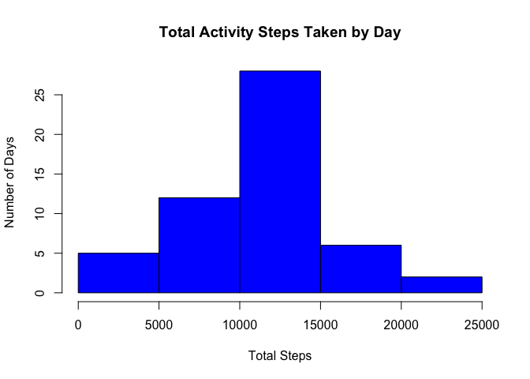
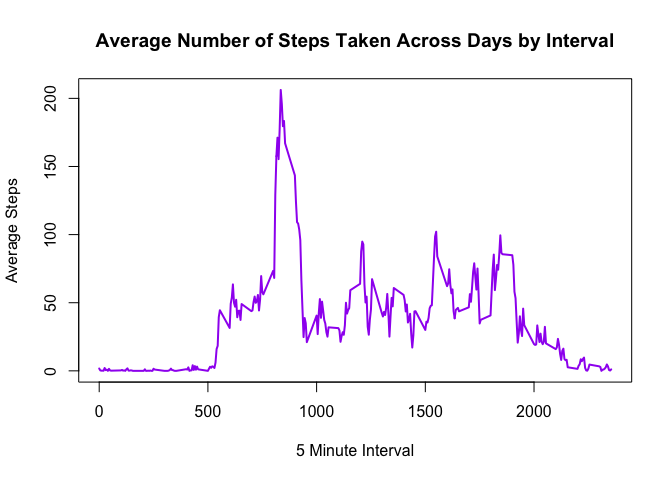
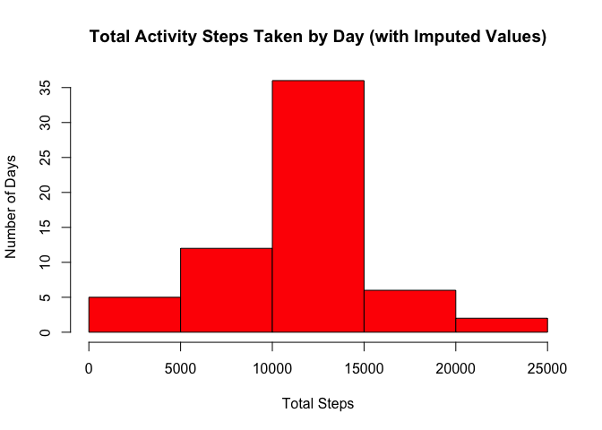
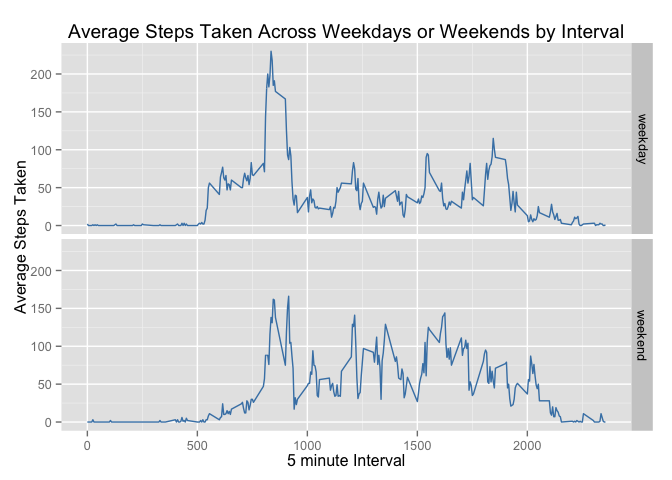

# Reproducible Research: Peer Assessment 1
This assignment is to perform analysis on the steps taken using a personal activity monitoring device.  The data represents two months of step activity from one individual in October and November 2012.

## Loading and preprocessing the data

First, load the packages needed for this assignment  

```r
library(ggplot2)  
```

```
## Warning: package 'ggplot2' was built under R version 3.1.3
```

Second, set working directory and load data  


```r
steps <- read.csv("activity.csv")  
summary(steps)  
```

```
##      steps                date          interval     
##  Min.   :  0.00   2012-10-01:  288   Min.   :   0.0  
##  1st Qu.:  0.00   2012-10-02:  288   1st Qu.: 588.8  
##  Median :  0.00   2012-10-03:  288   Median :1177.5  
##  Mean   : 37.38   2012-10-04:  288   Mean   :1177.5  
##  3rd Qu.: 12.00   2012-10-05:  288   3rd Qu.:1766.2  
##  Max.   :806.00   2012-10-06:  288   Max.   :2355.0  
##  NA's   :2304     (Other)   :15840
```
=========================================================================

## What is mean total number of steps taken per day?

Ignoring the missing values in the data set--  
This next set of code will make a histogram of the total number of steps per day and will calculate and report the mean and median of the total number of steps per day


```r
d<-aggregate(steps~date, data=steps, sum)
hist(d$steps, 
     main="Total Activity Steps Taken by Day",  
     xlab="Total Steps", 
     ylab="Number of Days",
     border="black",  
     col="blue")
```

 


```r
m <- mean(d$steps) 
n <- as.integer(m)
o <- median(d$steps)  
```
The mean of the total number of steps taken per day is 10766 steps;   
the median of the total number of steps taken per day is 10765 steps.
======================================================================

## What is the average daily activity pattern?

Make a time series plot of the 5 minute interval and the avg number of steps taken, averaged across all days.  Which 5 minute interval, across all days in dataset, contains the maximum number of steps


```r
q<-aggregate(steps~interval, data=steps, mean)
plot(q$interval, q$steps, type="l", main="Average Number of Steps Taken Across Days by Interval", xlab="5 Minute Interval", ylab="Average Steps", col="purple", lwd=2)
```

 

```r
t <- q[q$steps==max(q$steps),]
m <- t$interval
o <- t$steps
o <- as.integer(o)  
```

The 5 minute interval with the maximum number of steps is interval 835 at an average across all the days of 206 steps.

==========================================================================

## Imputing missing values

To ensure all days are in the dataset (should be 61 days) and there are 288 intervals per day - we should have a total of 17,568 records in the dataset (61*288=17,568 record)

Check data totals in original dataset

```r
str(steps)
```

```
## 'data.frame':	17568 obs. of  3 variables:
##  $ steps   : int  NA NA NA NA NA NA NA NA NA NA ...
##  $ date    : Factor w/ 61 levels "2012-10-01","2012-10-02",..: 1 1 1 1 1 1 1 1 1 1 ...
##  $ interval: int  0 5 10 15 20 25 30 35 40 45 ...
```

```r
#Next check which NAs need imputed
summary(steps)
```

```
##      steps                date          interval     
##  Min.   :  0.00   2012-10-01:  288   Min.   :   0.0  
##  1st Qu.:  0.00   2012-10-02:  288   1st Qu.: 588.8  
##  Median :  0.00   2012-10-03:  288   Median :1177.5  
##  Mean   : 37.38   2012-10-04:  288   Mean   :1177.5  
##  3rd Qu.: 12.00   2012-10-05:  288   3rd Qu.:1766.2  
##  Max.   :806.00   2012-10-06:  288   Max.   :2355.0  
##  NA's   :2304     (Other)   :15840
```

Per this output there are 61 date levels and a total of 17,568 records in the original dataset. The STEPS field is the only field with missing values.  Since the grain of the records in the original dataset is at the day and interval level, missing values will be imputed with the average of the daily steps by interval calculated above.

Code to get dataset wtih imputed values

```r
#get dataset with completed cases only (No NAs)
x <- na.omit(steps)
steps.y <- as.numeric(x$steps)
stepsbind <- cbind(x,steps.y)

#get dataset with NAs only
y <- steps[!complete.cases(steps),]

#merge the aggregate dataset above average steps by day by interval-q
#and merge it with y above to impute the steps
z <- merge(y, q, by.x="interval", by.y="interval", all=TRUE) 
zz <- z[c(2,3,1,4)]        
colnames(zz) <- c("steps", "date", "interval", "steps.y")

#combine and sort the nas with non-nas
stepsfin <- rbind(stepsbind,zz)
stepsfin <- stepsfin[order(stepsfin[,2], stepsfin[,3]), ]  
```

=======================================================================

After imputing the average of steps across days by interval
make a histogram of the total number of steps per day and will calculate and report the mean and median of the total number of stesp per day


```r
dimp<-aggregate(steps.y~date, data=stepsfin, sum)
hist(dimp$steps.y, 
     main="Total Activity Steps Taken by Day (with Imputed Values)",  
     xlab="Total Steps", 
     ylab="Number of Days",
     border="black",  
     col="red")
```

 


```r
m <- mean(dimp$steps.y) 
n <- as.integer(m)
o <- median(dimp$steps.y) 
o <- as.integer(o)
```
The mean of the total number of steps taken per day is 10766 steps; 
The median of the total number of steps taken per day is 10766 steps.

RESULTS:  

In the analysis with the missing values the mean was 10766 steps and the median was 10765 steps.  In the analysis with the imputed values the mean is still 10766 steps but now the median matches at 10766 steps. These differences do not make a major impact in both analyses, the means and medians are very close.  

One impact of imputing the data that is noticeable is that the number of days that had a sum of steps in the 10000 to 15000 bin increased from 25 to 35 days.

========================================================================

## Are there differences in activity patterns between weekdays and weekends?

First a new factor variable was created in the imputed dataset with two levels – “weekday” and “weekend” indicating whether a given date is a weekday or weekend day


```r
stepsfin$date <- as.Date(strptime(stepsfin$date, format="%Y-%m-%d"))  
 
# convert date to a date() class variable  
# insert a day field to hold if its weekday or weekend

stepsfin$day <- weekdays(stepsfin$date)  

for (i in 1:nrow(stepsfin)) {                                            
        if (stepsfin[i,]$day %in% c("Saturday","Sunday")) {          
        stepsfin[i,]$day<-"weekend"                                
      }
        else{
           stepsfin[i,]$day<-"weekday"                     
     }
 }
```

Make a panel plot containing a time series plot (i.e. type = “l”) of the 5-minute interval (x-axis) and the average number of steps taken, averaged across all weekday days or weekend days (y-axis). 


```r
## aggregate newData by steps as a function of interval + day  
b <- aggregate(stepsfin$steps.y ~ stepsfin$interval + stepsfin$day, stepsfin, mean)

## rename the columns
names(b) <- c("interval", "day", "steps")

b$steps <- as.integer(b$steps)

## panel plot weekday over weekend time series

g <- ggplot(b, aes(x=interval, y=steps))
g+geom_line(color="steelblue")+facet_grid(day~., labeller=label_parsed)+labs(title = "Average Steps Taken Across Weekdays or Weekends by Interval") + labs(x = "5 minute Interval", y = "Average Steps Taken")
```

 

This individual during October and November 2012 seemed to have more step activity on the weekend during the day from 10 AM to 10 PM at night.  During the weekdays the step activity is higher starting at 5 or 6 in the morning compared to 5 or 6 in the mornings on weekends.  The highest average occurs during the weekdays between 8 AM and 9 AM. 

